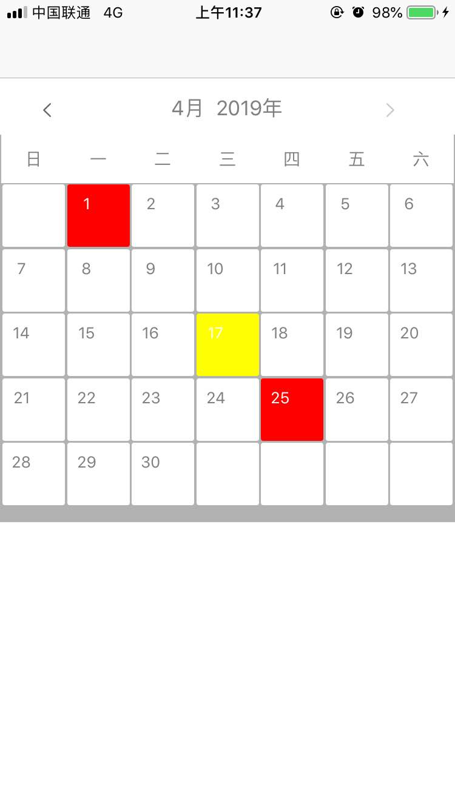

# LHQCalendarDemo
iOS 一个简易的日历

####功能说明
1. 默认显示当天日期
2. 限制可翻到月份即当前月份
3. 预留接口限制可翻最小日期月份
4. 预留标记数组作为日历标记项

```
_calendarView = [[WTCalendarView alloc]initWithFrame:CGRectMake(0, 0, kScreenWidth, kW(360))];
        _calendarView.delegate = self;
        NSDate *date1 = [NSDate stringToDate:@"2019-04-25" format:YMD];
        NSDate *date2 = [NSDate stringToDate:@"2019-04-01" format:YMD];
        NSDate *date3 = [NSDate stringToDate:@"2019-02-21" format:YMD];
        _calendarView.signArray = @[date1,date2,date3];
        NSDate *date4 = [NSDate stringToDate:@"2018-11-21" format:YMD];
        _calendarView.pastDate = date4;
```


